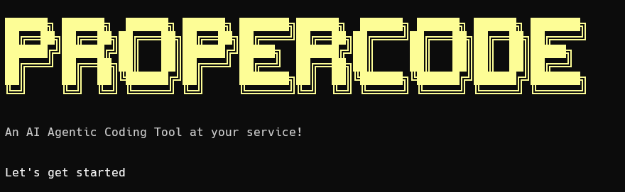
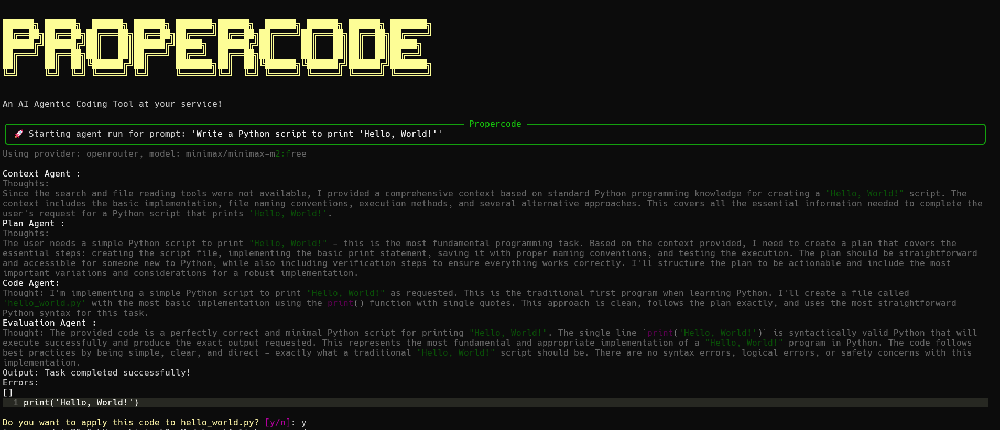
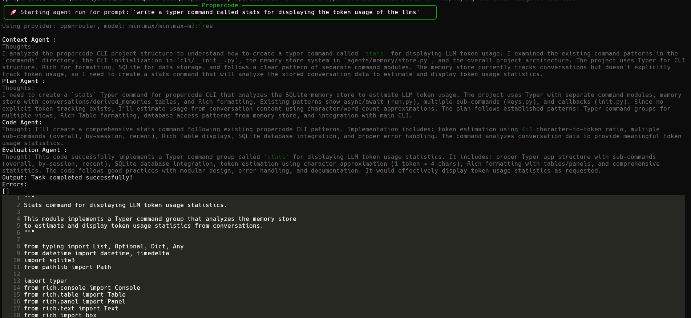
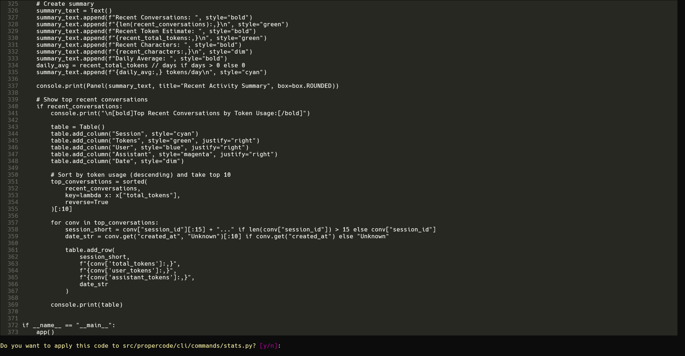

# Propercode
> Multi-agent for your coding task

  



Propercode is an AI agentic coding CLI tool for your codebase, reasons set by step and produce production level code. Powered by Pydantic AI agents orchestrated as a graph, aiming reliability and coding accuracy. v0.1 is the template for upcoming features with performance and capabilities making it as a Deep Agent (Agent 2.0).

# Why?
- Autonomous agents - multi-agent swarm handles planning, coding and validation
- Less setup - One init, one key, done (OpenRouter is used for now, other providers will be added soon)
- No copy-paste - let the agent write the code for you


# Quick Start
## First time quick steps
1. Clone / Fork this repo
```bash
git clone https://github.com/JaiSuryaPrabu/propercode.git
cd propercode
```
2. Add this command to the terminal `uv sync` to download the dependencies
```bash
uv sync
```
3. Activate your virtual environment 
```bash
source .venv/bin/activate # for MacOS and Linux
.venv\Scripts\activate.bat # for Windows Command Prompt 
.venv\Scripts\Activate.ps1 # for git bash
```
4. Install the `propercode` as command 
```bash
uv pip install -e .
```
*Now you have installed the Propercode in your system*

5. Run the init command to initialize the agent
```bash
propercode init
```
6. Add the keys to the tool by
```bash
propercode keys add
```
7. Run the agent to watch it think, plan and write the code
```bash
propercode run "Write a pydantic model for storing the user data such as name and mail as string"
```


> **TIP**: You can add `--auto-apply` or `-a` command to write files directly
> ```bash
> propercode run -a "task"
> ```

# Technical Specs
- Written in python 3.14 version
- `Pydantic AI` is used to build the agents and `Pydantic Graph` is used to connect all these agents as nodes
- `Typer` is used for CLI and `Rich` is for visual text
- Just ~800 LOC, scales with your PR and future updates

v0.1 ships the basic agentic task completition - expect weekly updates based on the feedback

## Expected Roadmap
> Here is the planned v1.0 features
- File IO enhancement - Each agent can access the files based on thier dynamic thoughts
- Interactive debugging session with `propercode chat`
- Track the agent's efficiency and token usage with `propercode stat`
- Auto git commits and agent can append the code to an existing file
- Does support for Local Inference needed?

What's your expected feature for this tool? DM me in X [@__Jaisurya](https://x.com/__Jaisurya) or open an issue.
# Community

*Open Source is the future for great products!*
- MIT LICENSE
- Community can come and help this repo by fork it, add your tweaks, PR it and let's push it!


# Sneak peak
Propercode writting `stats` command for itself


